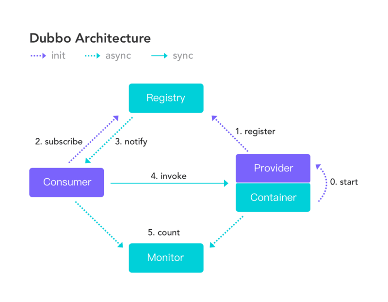

# twins-rpc

### 介绍

---
基于Netty + Kryo + Zookeeper 实现的一个简易rpc框架

### 基本的框架设计思路

---
参考阿里巴巴开源的rpc框架[Dubbo](https://cn.dubbo.apache.org/zh-cn/index.html)进行项目结构设计
 

 
一般情况下，RPC 框架要提供以下几个功能
1. 注册中心，注册中心负责服务地址的注册与查找
2. 网络传输，本项目采用基于 NIO 的 Netty 框架
3. 序列化，JDK 自带的序列化效率低，目前支持kryo序列化
4. 动态代理，基于jdk动态代理生成动态代理类进行调用
5. 负载均衡，集群部署需要流量均匀流入各个服务
6. ...

### 项目实现

---

- [x] 基于 Netty 的 NIO 网络传输
  - [x] 复用 Channel 避免重复连接服务端
  - [x] 基于 Netty 实现心跳机制，避免每次请求都进行连接
- [x] 基于注册中心进行服务发现与服务配置
  - [x] zookeeper
  - [ ] nacos
- [x] 使用开源的序列化机制 Kryo 替代 JDK 自带的序列化机制
  - [ ] 更多的序列化实现
- [x] 调用远程服务提供负载均衡机制
  - [x] 实现了随机负载均衡算法
  - [ ] 更多的负载均衡算法实现 
- [x] 客户端服务端通信数据包结构设计
  - [x] 支持魔数作为请求头标识，服务端可对其进行对比，增强安全性，节约资源
  - [x] 结构内包含序列化器编号，压缩器编号
- [x] 参考 grpc 实现基于本地配置提供远程服务地址，暂时只支持硬编码配置
  - [ ] 使用配置类简化
- [x] 服务发布信息实现服务分组，服务版本号机制
- [ ] 实现 server/client 工厂，支持自定义组装服务，包括序列化方式，压缩算法，负载均衡算法
- [ ] 集成 Spring 通过注解注册服务、消费服务

